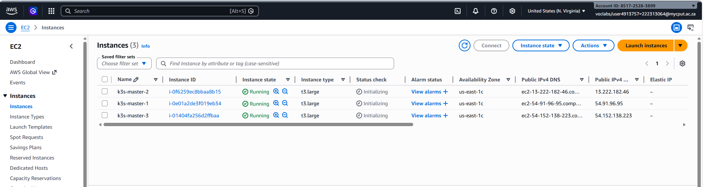
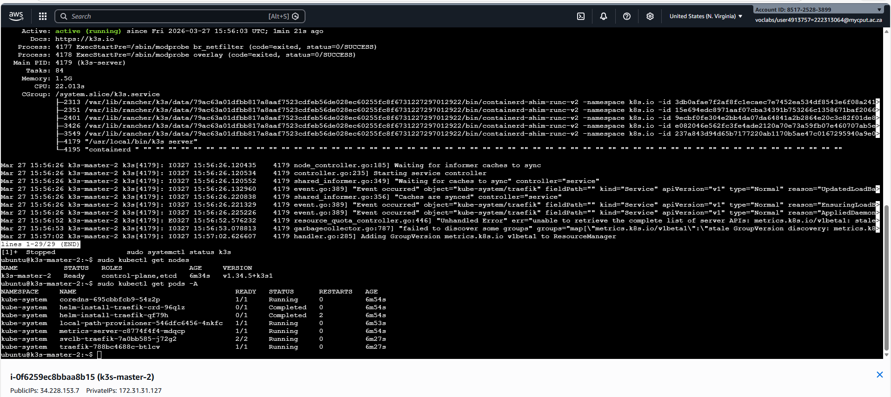
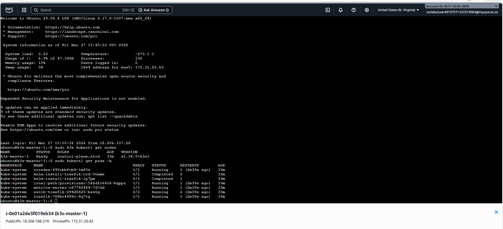
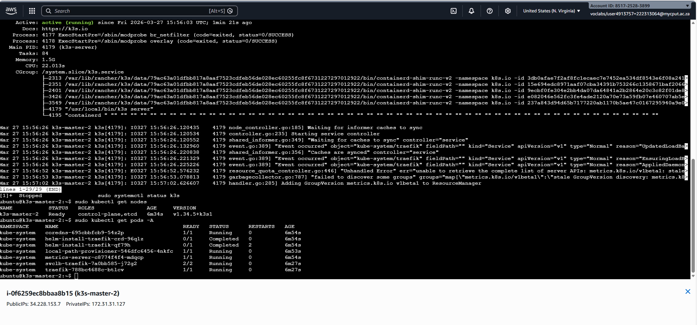
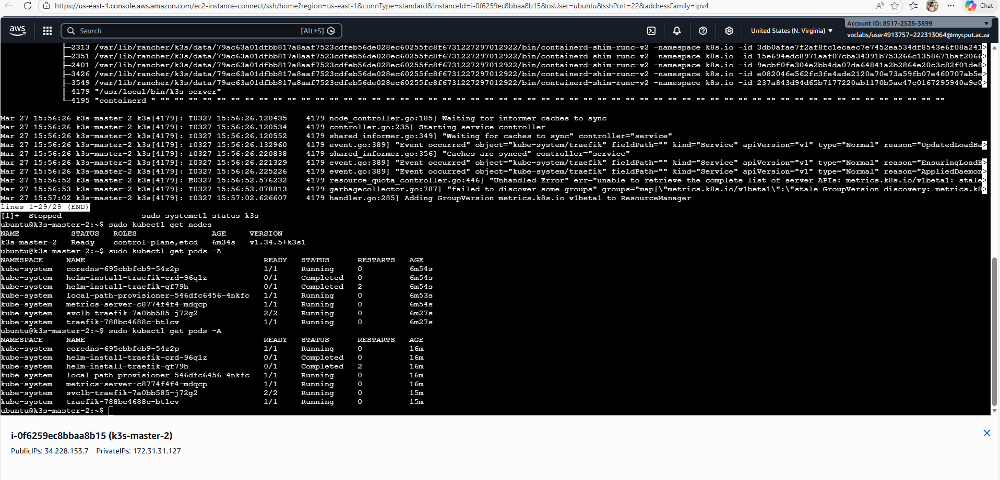

# Assignment 1: K3s Deployment on AWS
**Name:** REYANESTI RAMAHODI 
**Student Number:** 222313064  
**Course:** Advanced Diploma in IT (Communication Networks)

---

## Explanation of the Architecture
### What is K3s
is a lightweight and certified distribution by rancher. It is designed for resource-constrained environments.
K3s bundles everything into a single binary, and it simplifies installation. It is perfect for learning.

### The Key Components
* **Control Plane:** The brain of the cluster, containing the API Server (entry point), Scheduler (assigns pods), and Controller Manager (maintains desired state).
* **Agents (Worker Nodes):** The hosts where the actual containerized workloads run.
* **Container Runtime:** Uses **containerd** as a lightweight, industry-standard runtime.
* **CNI (Flannel):** Manages the L3 networking fabric for Pod-to-Pod communication.
* **Kine:** A shim that allows K3s to use **SQLite** (embedded) instead of the resource-heavy etcd, perfect for edge deployments.
* **ServiceLB & Traefik:** Built-in Load Balancer and Ingress controller for exposing services.

---
### 3. Evidence of Deployment

## 3.1 Cluster Node Status
This screenshot confirms that the K3s cluster is operational. It shows 3 master nodes in a **Ready** status, running the latest K3s version.

## 3.2 System Pods and Networking Status

## 3.2.1 master 1 Nodes
The following output shows that master 1 nodes are fully functional.

## 3.2.2 master 1 Pods
The following output shows that master 1 pods are fully functional.

## 3.2.3 master 2 nodes & pods
The following output shows that master 2 nodes & pods are fully functional.

## 3.2.4 master 3 nodes & pods
The following output shows that master 3 nodes & pods are fully functional.

## 3.2.5 Final deployment

## System Requirements that i used :
| Requirement | Master |
| :--- | :--- | :--- |
| **Instance Type** | t3.large |
| **vCPU** | 2 |
| **RAM** | 8 GB | 
| **Storage** | 50 GB gp3 SSD | 
| **OS** | Ubuntu 22.04 LTS | 

---

## Installation Steps & Commands

### 1. Provisioning & Security
Configured an AWS VPC with a Security Group allowing:
* `6443/tcp`: Kubernetes API Server
* `8472/udp`: Flannel VXLAN
* `10250/tcp`: Kubelet metrics

## Technical reflection
What did I learn?
Throughout this assignment, I deepened my understanding of how a Kubernetes cluster is built from the ground up. I learned that even a lightweight distribution like k3s still requires careful attention to networking, hos

