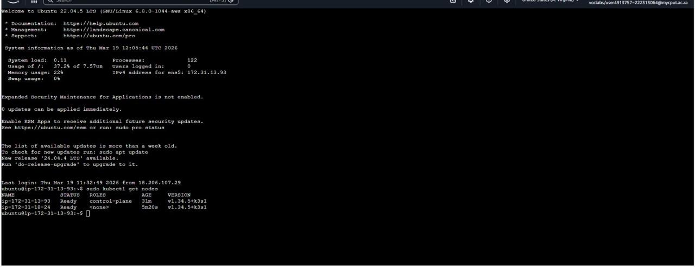
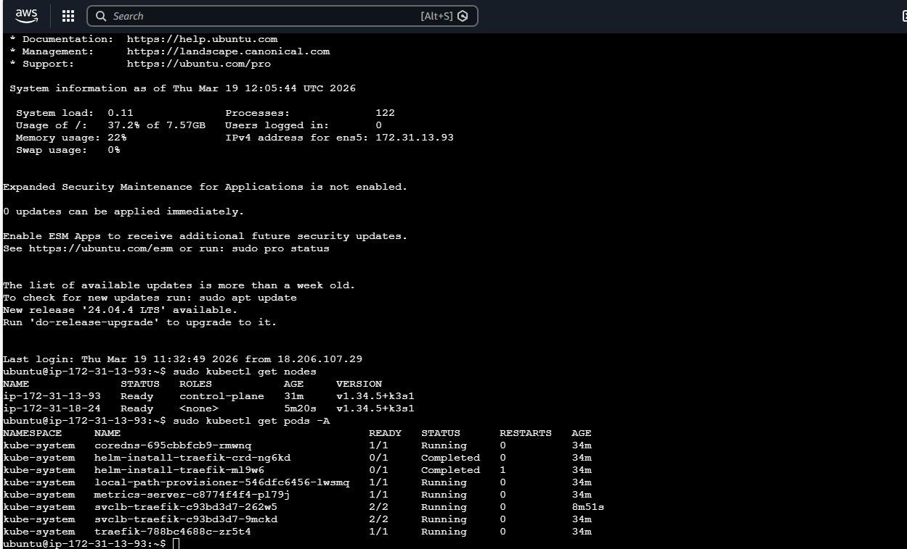
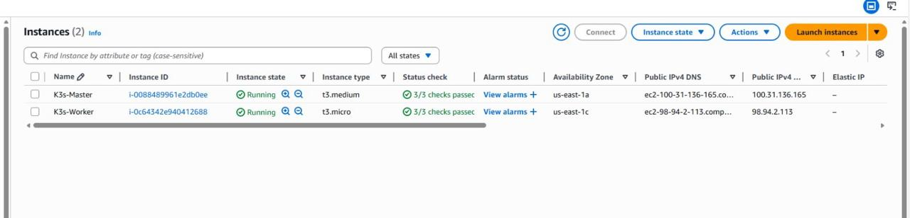

# Assignment 1: K3s Deployment on AWS
**Name:** REYANESTI RAMAHODI 
**Student Number:** 222313064  
**Course:** Advanced Diploma in IT (Communication Networks)

---

## Explanation of the Architecture
### What is K3s?
K3s is a highly available, certified Kubernetes distribution designed for low-resource environments such as Edge, IoT, and 5G infrastructures. It is packaged as a single binary (<100MB) by removing legacy, alpha, and non-default features found in standard upstream Kubernetes.

### The Key Components
* **Control Plane:** The brain of the cluster, containing the API Server (entry point), Scheduler (assigns pods), and Controller Manager (maintains desired state).
* **Agents (Worker Nodes):** The hosts where the actual containerized workloads run.
* **Container Runtime:** Uses **containerd** as a lightweight, industry-standard runtime.
* **CNI (Flannel):** Manages the L3 networking fabric for Pod-to-Pod communication.
* **Kine:** A shim that allows K3s to use **SQLite** (embedded) instead of the resource-heavy etcd, perfect for edge deployments.
* **ServiceLB & Traefik:** Built-in Load Balancer and Ingress controller for exposing services.

---

## System Requirements that i used :

| Requirement | Control Plane (Server) | Agent (Worker) |
| :--- | :--- | :--- |
| **Instance Type** | t3.medium | t3.small |
| **vCPU** | 2 | 1 |
| **RAM** | 4 GB | 2 GB |
| **Storage** | 20 GB gp3 SSD | 20 GB gp3 SSD |
| **OS** | Ubuntu 22.04 LTS | Ubuntu 22.04 LTS |

---

## 🛠 Installation Steps & Commands

### 1. Provisioning & Security
Configured an AWS VPC with a Security Group allowing:
* `6443/tcp`: Kubernetes API Server
* `8472/udp`: Flannel VXLAN
* `10250/tcp`: Kubelet metrics

### 3. Evidence of Deployment

## 3.1 Cluster Node Status (Master and Worker)
This screenshot confirms that the K3s cluster is operational. It shows both the Control Plane and the Worker node in a **Ready** status, running the latest K3s version.

## 3.2 System Pods and Networking Status
The following output shows all system-level pods (CoreDNS, Metrics Server, and Traefik) running across the namespace. This confirms that the internal networking (Flannel) and Ingress (Traefik) are fully functional.

## 3.3 AWS EC2 Management Console
This view from the AWS Console shows the two active EC2 instances (**t3.medium** for the Master and **t3.micro** for the Worker) in the `running` state within the `us-east-1` region.

### 4. Technical Reflection

## 4.1 Development Insights & Technical Competency
This deployment offered a practical deep dive into the lifecycle of cloud-native systems. A key takeaway was the critical dependency between Kubernetes cluster stability and the underlying network architecture. Moving beyond basic script execution, I gained a functional understanding of AWS Security Groups, VPC traffic routing, and the implementation of secure node-to-node authentication via cluster tokens. Differentiating between the Control Plane (Master) and the Agent (Worker) provided a clear perspective on how state and high availability are managed across a distributed virtual environment.

## 4.2 Technical Obstacles & Solutions
A primary administrative hurdle was encountering a "Permission Denied (403)" error during the GitHub push process. While initially suspected to be a local authentication failure, troubleshooting revealed it was a permissions issue regarding the organization’s template. I successfully resolved this by re-mapping my local directory to my specific GitHub Classroom repository.

From a technical standpoint, I faced a Connection Timeout when attempting to link the worker node. By performing a security audit on the AWS console, I identified that Port 6443 (API) and UDP Port 8472 (VXLAN) were restricted. Once I updated the master node's inbound rules to permit traffic from the worker's private range, the node status successfully transitioned to "Ready." This underscored the necessity of "Security by Design" in cloud deployments.

## 4.3 K3s Integration in 5G Cloud-Native Frameworks
K3s serves as a fundamental building block for 5G Cloud-Native architectures. Modern 5G networks require low-latency execution at the Network Edge, where hardware constraints make standard Kubernetes (K8s) impractical.

By substituting the resource-intensive etcd database with SQLite, K3s offers a CNCF-compliant, lightweight alternative. This allows for the efficient management of Containerized Network Functions (CNFs) on smaller edge nodes. This ensures that critical 5G services, such as the User Plane Function (UPF), maintain high performance on cost-effective hardware while retaining the orchestration capabilities of a full-scale production environment.

## 4.4 Scaling through Virtualization and Containerization
The synergy between virtualization and containerization is the engine behind scalable, elastic cloud services. Virtualization (via AWS EC2) provides the abstracted hardware layer, allowing for the rapid deployment of isolated virtual machines. Containerization (via K3s/containerd) then enables applications and their dependencies to be packaged into efficient units for deployment across those machines.

This dual approach facilitates Horizontal Scaling; if 5G network demand surges, additional EC2 instances can be provisioned (Virtualization) and new pods can be immediately replicated (Containerization) to distribute the load. This ensures that the network remains portable, resilient, and highly responsive to user demand.
