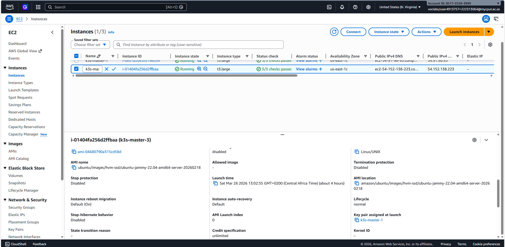
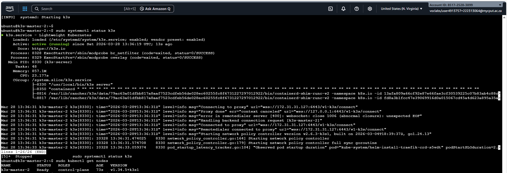

# Assignment 1: K3s Deployment on AWS
**Name:** REYANESTI RAMAHODI 
**Student Number:** 222313064  
**Course:** Advanced Diploma in IT (Communication Networks)

---

## Explanation of the Architecture
### What is K3s
is a lightweight and certified distribution by rancher. It is designed for resource-constrained environments.
K3s bundles everything into a single binary, and it simplifies installation. It is perfect for learning.

### The Key Components
* **Control Plane:** The brain of the cluster, containing the API Server (entry point), Scheduler (assigns pods), and Controller Manager (maintains desired state).
* **Agents (Worker Nodes):** The hosts where the actual containerized workloads run.
* **Container Runtime:** Uses **containerd** as a lightweight, industry-standard runtime.
* **CNI (Flannel):** Manages the L3 networking fabric for Pod-to-Pod communication.
* **Kine:** A shim that allows K3s to use **SQLite** (embedded) instead of the resource-heavy etcd, perfect for edge deployments.
* **ServiceLB & Traefik:** Built-in Load Balancer and Ingress controller for exposing services.

---
### 3. Evidence of Deployment

## 3.1 Cluster Node Status
This screenshot confirms that the K3s cluster is operational. It shows 3 master nodes in a **Ready** status, running the latest K3s version.

This screenshot shows the operating system i used on my instances.

.

## 3.2 System Pods and Networking Status

## 3.2.1 master 1 Nodes
The following output shows that master 1 nodes are fully functional.

## 3.2.2 master 1 Pods
The following output shows that master 1 pods are fully functional.

## 3.2.3 master 2 nodes & pods
The following output shows that master 2 nodes & pods are fully functional.

## 3.2.4 master 3 nodes & pods
The following output shows that master 3 nodes & pods are fully functional.

## 3.2.5 Final deployment

This screenshot shows the final deployment of nodes 

## System requirements
| Requirement | Master |
| :--- | :--- | 
| **Instance Type** | t3.large |
| **vCPU** | 2 |
| **RAM** | 8 GB | 
| **Storage** | 50 GB gp3 SSD | 
| **OS** | Ubuntu 22.04 LTS | 

---

## Installation Steps & Commands

### 1. Provisioning & Security
Configured an AWS VPC with a Security Group allowing:
* `6443/tcp`: Kubernetes API Server
* `8472/udp`: Flannel VXLAN
* `10250/tcp`: Kubelet metrics

## Technical reflection

## What did I learn?
Throughout this assignment, I deepened my understanding of how a Kubernetes cluster is built from the ground up. I learned that even a lightweight distribution like k3s still requires careful attention to networking, hostname resolution, and careful IP addressing. The process of joining additional control plane nodes to form a high availability cluster taught me about the importance of the cluster token. I also gained hands on experience on configurations and troubleshooting. 

## Challenges faced and how I resolved them
The main challenge was getting the three master nodes to successfully join into a single cluster. Initially, after installing k3s on the first node and configuring the second and third nodes with the proper token and server address, the join attempts failed with context deadline exceeded errors. This indicated that the nodes could not reach the API server on port 6443.
I first checked that the API server was listening on the first master using ss -tlnp | grep 6443, which confirmed it was. I then reviewed the AWS security group rules. The security group was only allowing SSH (port 22) from my IP, and no internal traffic between instances. By adding an inbound rule to allow all TCP traffic from the private subnet CIDR (172.31.0.0/16), the nodes were able to communicate on port 6443 and join successfully. This experience highlighted how critical security group configuration is in cloud based Kubernetes deployments.
I also encountered a YAML syntax error in the config file (line 11: could not find expected ':'), which I resolved by carefully checking the colon and spacing. These troubleshooting steps reinforced the importance of methodical debugging.

## How does k3s relate to production Kubernetes/5G cloud native concept?
k3s is a fully compliant Kubernetes distribution, meaning anything you learn on k3s is directly transferable to larger production clusters (e.g., EKS, AKS, GKE). Its lightweight nature makes it ideal for edge and 5G deployments, where resources are limited and low latency is critical. 5G networks rely heavily on cloud native principles – microservices, containerization, and orchestration – to provide network functions like UPF (User Plane Function) and CUPS (Control and User Plane Separation). k3s can run these components at the edge, enabling a distributed, scalable infrastructure that aligns with 5G’s architecture.

## How do virtualization and containerization enable scalable services?
Virtualization abstracts physical hardware into virtual machines, allowing multiple workloads to run on a single server with isolation. Containerization goes a step further by packaging applications and their dependencies into lightweight containers, which share the host OS kernel. This leads to faster startup times, smaller footprints, and easier orchestration. Together, they form the foundation of modern cloud native infrastructure. Virtualization provides the underlying VMs (like our EC2 instances) that give us flexibility in resource allocation and isolation, while containerization (via Kubernetes) enables automated scaling, self healing, and declarative management of applications. In a 5G context, this combination allows network functions to be deployed as containers that can be scaled up/down dynamically based on traffic demands, ensuring efficient resource utilization and high availability.

